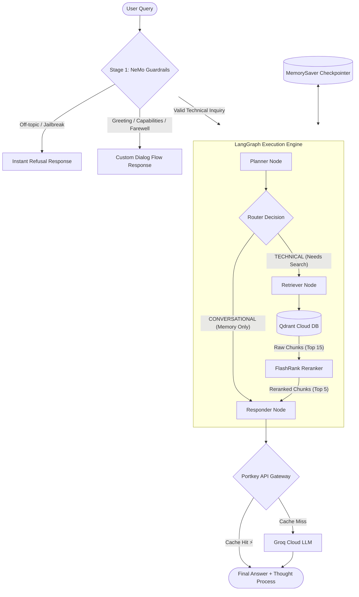

# Enterprise Agentic RAG System

Welcome to the **Enterprise Agentic RAG (Retrieval-Augmented Generation)** project workspace! This repository is a production-ready, highly robust implementation of an intelligent enterprise IT advisor specializing in **Kubernetes, Intel Hardware (CPUs, FPGAs, SRIOV, NICs), and Enterprise Networking**.

It is engineered with a multi-layered gate architecture, conversational memory, fallback LLMs, semantic reranking, prompt caching, and dual-layer distributed tracing.

---

## 🏗️ System Architecture & Flow

The system processes incoming user queries via a strict two-stage gate check: NeMo Guardrails acts as the initial firewall, and LangGraph coordinates the active memory retrieval and synthesis loop.



---

## 📁 Repository Structure

```
├── .env                          # Local credentials & cloud API keys
├── requirements.txt              # Unified dependency file
├── README.md                     # This system flow manual
├── RAG_Flow_Guide.pdf            # PDF handbook export of the architecture
├── langgraph_flow.png            # Visual graph of compiled LangGraph workflow
├── app/
│   ├── main.py                   # FastAPI Application Entrypoint
│   ├── config.py                 # Pydantic Settings & Env mappings
│   ├── gateway/                  # Portkey Gateway wrapper & LLM client fallbacks
│   ├── guardrails/               # NeMo Guardrails configuration and Colang flows
│   ├── agents/                   # LangGraph Agent state machine, router, and memory
│   │   ├── graph.py              # Main graph setup & compilation
│   │   ├── state.py              # TypedDict state structure
│   │   └── nodes/                # Planner, Retriever, and Generator nodes
│   ├── ingestion/                # Document parsers, chunking, and database uploads
│   └── services/                 # Embeddings & semantic reranking services
└── ui/
    ├── app.py                    # Streamlit chat interface (Primary UI)
    └── st_cloud_ui.py            # Streamlit cloud-deployed UI variant
```

---

## 🌊 In-Depth Data Flows

### 1. Document Ingestion Flow (`processor.py`)
This pipeline converts raw documents in `DATA/` to vector embeddings in Qdrant Cloud:

1. **File Scanning & Parsing**: Iterates over files in `DATA/` and routes them by extension:
   * **PDF**: Local text extraction using [pypdf](file:///d:/production%20advance%20rag/requirements.txt#L36) or [pdfplumber](file:///d:/production%20advance%20rag/requirements.txt#L38).
   * **HTML**: Fast extraction using [beautifulsoup4](file:///d:/production%20advance%20rag/requirements.txt#L37).
   * **DOCX/PPTX**: Structured parsing using [python-docx](file:///d:/production%20advance%20rag/requirements.txt#L35) and [python-pptx](file:///d:/production%20advance%20rag/requirements.txt#L34).
2. **Recursive Character Chunking**: Breaks text into chunks (target size: 1000 characters, overlap: 200) to ensure high context preservation.
3. **Local Cache Persistence**: Saves processed chunks and filenames as audit logs under `processed_data/` local directory.
4. **Probe & Dual-Embedding Fallback**:
   * Probes the Google Gemini API. If healthy, computes embeddings using `models/gemini-embedding-2-preview` (producing **3,072-dimensional** vectors).
   * If the API fails or credentials are empty, embeds text using a local SentenceTransformer model `all-mpnet-base-v2` (**768-dimensional** vectors).
5. **Index Creation & Upsert**: Drops and creates the collection in Qdrant with matching vector dimensions (using Cosine distance) and upserts vectors along with payload details (metadata: `text`, `source`, `source_type`).

---

### 2. User Query Processing Flow (`main.py`)

When a user submits a query to `/query`:

1. **NeMo Guardrails Gate (`app.guardrails.rails.guard`)**:
   * Evaluates the prompt against Colang flows (`colang_rules.py`).
   * **Refusals**: Prompts about non-IT topics (e.g. food, history) or system jailbreaks trigger immediate refusals, returning canned messages.
   * **Conversational Dialogs**: Standard greetings or capability requests trigger quick dialog responses.
   * **Valid Technical Queries**: Pass through to the LangGraph execution block.
2. **LangGraph Processing (`app.agents.graph.rag_agent`)**:
   * **Planner Node**: The LLM analyzes the current query and message history. If the query is conversational/greeting, it outputs `'CONVERSATIONAL'`. If technical, it refines the search query.
   * **Router Edge**:
     * Routes `'CONVERSATIONAL'` prompts directly to the **Responder Node** (skipping vector retrieval).
     * Routes search queries to the **Retriever Node**.
   * **Retriever Node**:
     * Queries Qdrant Cloud using the `query_points` API to find the top 15 candidates.
     * **Semantic Reranking**: Sends candidates to the local [FlashRank Cross-Encoder](file:///d:/production%20advance%20rag/app/services/retrieval/ranking_service.py) (ONNX-optimized `ms-marco-MiniLM-L-6-v2`) which scores and trims them to the **top 5** most relevant chunks.
   * **Responder Node**:
     * Standardizes the context, formats the prompt, and completes the LLM response via Portkey.
     * Surfaces cache indicators like `Cache: Hit ⚡` in the UI if Portkey served it from cache.
   * **MemorySaver**: Checkpoints the state against the provided `thread_id` so that the agent remembers conversational history across queries.

---

## ☁️ Cloud Setup & Credentials

The system integrates six SaaS/PaaS systems. Here is the configuration schema for your `.env` file:

| Service | Environment Variable | Purpose | Sign-Up/Console |
| :--- | :--- | :--- | :--- |
| **Qdrant Cloud** | `QDRANT_CLUSTER_ENDPOINT`<br>`QDRANT_API_KEY` | Managed vector database cluster. | [Qdrant Cloud Console](https://cloud.qdrant.io/) |
| **Google AI Studio** | `GEMINI_API_KEY` | Generates high-dimension 3,072 embeddings. | [Google AI Studio](https://aistudio.google.com/) |
| **Groq Cloud** | `GROQ_API_KEY`<br>`GROQ_FALLBACK_API_KEY` | Runs LLM engines (`llama-3.3-70b-versatile`, `llama-3.1-8b-instant`). | [Groq Console](https://console.groq.com/) |
| **Portkey Gateway** | `PORTKEY_API_KEY`<br>`PORTKEY_CONFIG_ID` | Provides LLM unified proxy caching, fallback routing, and retry logic. | [Portkey Dashboard](https://app.portkey.ai/) |
| **Pydantic Logfire** | `LOGFIRE_TOKEN` | Centralized system telemetry and APM monitoring. | [Logfire Console](https://logfire.pydantic.dev/) |
| **LangSmith** | `LANGSMITH_API_KEY`<br>`LANGSMITH_TRACING=true` | Detailed execution tracing for LangChain/LangGraph pipelines. | [LangSmith Console](https://smith.langchain.com/) |

---

## 🛠️ Observability & Telemetry

### 1. Pydantic Logfire
* **What is tracked**: FastAPI routing, requests, search calls, embedding queries, and error stack traces.
* **Offline Fallback**: If `LOGFIRE_TOKEN` is blank, the app runs offline locally (`send_to_logfire=False`) without throwing auth prompts or locking the terminal.

### 2. LangSmith Tracing
* **What is tracked**: High-definition traces of prompt templates, inputs, outputs, router actions, and latency per node.
* **Configuration**: Set `LANGSMITH_TRACING=true` and your `LANGSMITH_API_KEY` in `.env`.

### 3. Portkey Caching
* **What is tracked**: LLM API calls are intercepted by the Gateway.
* **Header Inspection**: `generate_node` automatically parses `x-portkey-cache-status` headers. If the value is `HIT`, the system records it as a cache hit, optimizing latency and api token usage.

---

## 🚀 Operations Playbook

### 1. Run Data Ingestion
Load fresh files into the Qdrant Cloud index (processes files in `DATA/`):
```bash
# Wipe existing collection and ingest all data from the DATA folder
python -m app.ingestion.processor DATA --wipe

# Ingest data from a specific subdirectory as a specific source type without wiping
python -m app.ingestion.processor DATA/true_data true
```

### 2. Start the API Backend Service
Launch the FastAPI uvicorn server:
```bash
python -m uvicorn app.main:app --reload --host 127.0.0.1 --port 8000
```
* Once live, the Mermaid workflow graph can be generated as a PNG by sending a request to `http://127.0.0.1:8000/graph`.

### 3. Start the UI Dashboard
Launch the Streamlit interface:
```bash
python -m streamlit run ui/app.py
```
* Ensure `BACKEND_URL` in `.env` matches the backend endpoint, or leave it blank to default to `http://localhost:8000`.

---

## 🚨 Troubleshooting & Recovery

* **FastAPI Port Conflict (`Errno 10048`)**:
  * *Symptom*: FastAPI fails to bind to port 8000.
  * *Fix*: Kill the process occupying port 8000:
    ```powershell
    Stop-Process -Id (Get-NetTCPConnection -LocalPort 8000).OwningProcess -Force
    ```
* **Offline Logfire Prompts Hashing Startup**:
  * *Symptom*: Server hangs on boot when started in background headless modes due to logfire prompts.
  * *Fix*: The app automatically checks if `LOGFIRE_TOKEN` is empty and runs offline. If a block occurs, ensure your environment variables are configured correctly.
* **Streamlit UI '/query' No Scheme Supplied**:
  * *Symptom*: Streamlit dashboard console shows an invalid URL error.
  * *Fix*: If `BACKEND_URL` is set to `""` in `.env`, Streamlit translates it as an empty string instead of defaulting to localhost. The application has been patched to fall back to `http://localhost:8000` when `BACKEND_URL` is falsy or empty.
* **Portkey Fallback Model TypeErrors**:
  * *Symptom*: If no Portkey API key is specified, direct Groq calls fail with `TypeError: Missing required arguments: model`.
  * *Fix*: The custom `WrappedOpenAI` client wrapper in [client.py](file:///d:/production%20advance%20rag/app/gateway/client.py) automatically injects `model=settings.GROQ_MODEL` into direct completions requests, resolving API discrepancies.
