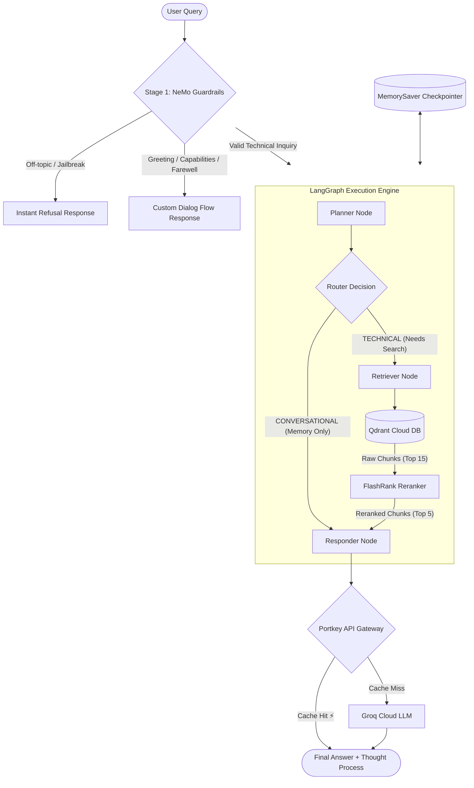
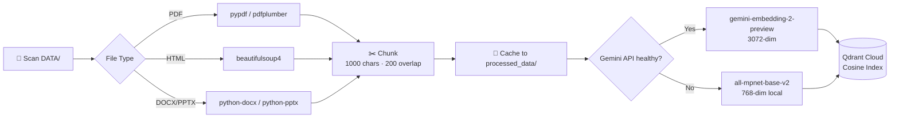

<div align="center">

# 🧠 Enterprise Agentic RAG System

### Production-Grade Intelligent IT Advisor

**Kubernetes** • **Intel Hardware** (CPUs, FPGAs, SR-IOV, NICs) • **Enterprise Networking**

<br>

[](https://www.python.org/)
[](https://fastapi.tiangolo.com/)
[](https://langchain-ai.github.io/langgraph/)
[](https://qdrant.tech/)
[](https://streamlit.io/)
[](https://groq.com/)

*Multi-layered gate architecture&nbsp;·&nbsp;Conversational memory&nbsp;·&nbsp;Fallback LLMs&nbsp;·&nbsp;Semantic reranking&nbsp;·&nbsp;Prompt caching&nbsp;·&nbsp;Dual-layer distributed tracing*

</div>

<br>

<div align="center">

| 🛡️ Guarded | 🧭 Agentic | 🔍 Reranked | ⚡ Cached | 👁️ Observable |
|:---:|:---:|:---:|:---:|:---:|
| NeMo Guardrails firewall stops jailbreaks & off-topic input before they ever reach the LLM | LangGraph plans, routes, and remembers — conversational turns skip retrieval entirely | Top-15 Qdrant hits are cross-encoded down to the top-5 most relevant chunks | Portkey Gateway serves repeat queries instantly with `Cache: Hit ⚡` | Logfire + LangSmith trace every node, call, and token end-to-end |

</div>

<br>

---

## 📖 Table of Contents

| | |
|---|---|
| 🏗️ | [System Architecture & Flow](#️-system-architecture--flow) |
| 📁 | [Repository Structure](#-repository-structure) |
| 🌊 | [In-Depth Data Flows](#-in-depth-data-flows) |
| ☁️ | [Cloud Setup & Credentials](#️-cloud-setup--credentials) |
| 🛠️ | [Observability & Telemetry](#️-observability--telemetry) |
| 🚀 | [Operations Playbook](#-operations-playbook) |

---

## 🏗️ System Architecture & Flow

> The system processes incoming user queries via a strict **two-stage gate check**: **NeMo Guardrails** acts as the initial firewall, and **LangGraph** coordinates the active memory retrieval and synthesis loop.


```mermaid
graph TD
    User([User Query]) --> Gate{Stage 1: NeMo Guardrails}
    
    %% Guardrails Fired
    Gate -- Off-topic / Jailbreak --> BlockResponse[Instant Refusal Response]
    Gate -- Greeting / Capabilities / Farewell --> DialogResponse[Custom Dialog Flow Response]
    
    %% Guardrails Passed
    Gate -- Valid Technical Inquiry --> Agent[Stage 2: Compiled LangGraph]
    
    subgraph Agent [LangGraph Execution Engine]
        Planner[Planner Node] --> RouteCheck{Router Decision}
        
        %% Conversational route
        RouteCheck -- "CONVERSATIONAL (Memory Only)" --> Responder[Responder Node]
        
        %% Technical route
        RouteCheck -- "TECHNICAL (Needs Search)" --> Retriever[Retriever Node]
        Retriever --> Qdrant[(Qdrant Cloud DB)]
        Qdrant -- Raw Chunks (Top 15) --> Reranker[FlashRank Reranker]
        Reranker -- Reranked Chunks (Top 5) --> Responder
    end
    
    %% Memory Saver
    Checkpoint[(MemorySaver Checkpointer)] <--> Agent
    
    %% Synthesis & API Gateway
    Responder --> Gateway{Portkey API Gateway}
    Gateway -- Cache Hit ⚡ --> UserResponse([Final Answer + Thought Process])
    Gateway -- Cache Miss --> LLM[Groq Cloud LLM]
    LLM --> UserResponse
```

<details>
<summary>💡 <b>Click to expand — flow cheat sheet</b></summary>
<br>

| Stage | Component | Role |
| :---: | :--- | :--- |
| 1️⃣ | **NeMo Guardrails** | Filters jailbreaks / off-topic input, handles greetings instantly |
| 2️⃣ | **Planner Node** | Decides `CONVERSATIONAL` vs `TECHNICAL` routing |
| 3️⃣ | **Retriever → Reranker** | Pulls top 15 from Qdrant → trims to top 5 via FlashRank cross-encoder |
| 4️⃣ | **Responder → Portkey** | Synthesizes final answer, checks cache before hitting Groq |
| 🧠 | **MemorySaver** | Checkpoints conversation state per `thread_id`, running alongside every stage |

</details>

---

## 📁 Repository Structure

<table>
<tr><td>

```text
├── .env                          # Local credentials & cloud API keys
├── requirements.txt              # Unified dependency file
├── README.md                     # This system flow manual
├── RAG_Flow_Guide.pdf            # PDF handbook export of the architecture
├── langgraph_flow.png            # Visual graph of compiled LangGraph workflow
├── app/
│   ├── main.py                   # FastAPI Application Entrypoint
│   ├── config.py                 # Pydantic Settings & Env mappings
│   ├── gateway/                  # Portkey Gateway wrapper & LLM client fallbacks
│   ├── guardrails/               # NeMo Guardrails configuration and Colang flows
│   ├── agents/                   # LangGraph Agent state machine, router, and memory
│   │   ├── graph.py              # Main graph setup & compilation
│   │   ├── state.py              # TypedDict state structure
│   │   └── nodes/                # Planner, Retriever, and Generator nodes
│   ├── ingestion/                # Document parsers, chunking, and database uploads
│   └── services/                 # Embeddings & semantic reranking services
└── ui/
    ├── app.py                    # Streamlit chat interface (Primary UI)
    └── st_cloud_ui.py            # Streamlit cloud-deployed UI variant
```

</td></tr>
</table>

<div align="center">

| Layer | Folder | Responsibility |
|:---|:---|:---|
| 🌐 API | `app/main.py`, `app/config.py` | Entrypoint & settings |
| 🚪 Gateway | `app/gateway/` | Portkey wrapper, LLM fallback logic |
| 🛡️ Safety | `app/guardrails/` | NeMo Guardrails, Colang flows |
| 🤖 Agent | `app/agents/` | LangGraph graph, state, nodes |
| 📥 Ingestion | `app/ingestion/` | Parsing, chunking, DB upload |
| 🧩 Services | `app/services/` | Embeddings, reranking |
| 🖥️ UI | `ui/` | Streamlit chat interfaces |

</div>

---

## 🌊 In-Depth Data Flows

### 1️⃣ Document Ingestion Flow — `processor.py`

> Converts raw documents in `DATA/` into vector embeddings inside Qdrant Cloud.


```mermaid
flowchart LR
    A[📂 Scan DATA/] --> B{File Type}
    B -- PDF --> C[pypdf / pdfplumber]
    B -- HTML --> D[beautifulsoup4]
    B -- DOCX/PPTX --> E[python-docx / python-pptx]
    C & D & E --> F[✂️ Chunk<br/>1000 chars · 200 overlap]
    F --> G[💾 Cache to processed_data/]
    G --> H{Gemini API healthy?}
    H -- Yes --> I[gemini-embedding-2-preview<br/>3072-dim]
    H -- No --> J[all-mpnet-base-v2<br/>768-dim local]
    I & J --> K[(Qdrant Cloud<br/>Cosine Index)]
```

<table>
<tr><td width="34"><b>1</b></td><td>

**File Scanning & Parsing** — iterates over files in `DATA/` and routes them by extension:
| Format | Library |
|:---|:---|
| PDF | [pypdf](file:///d:/production%20advance%20rag/requirements.txt#L36) or [pdfplumber](file:///d:/production%20advance%20rag/requirements.txt#L38) |
| HTML | [beautifulsoup4](file:///d:/production%20advance%20rag/requirements.txt#L37) |
| DOCX / PPTX | [python-docx](file:///d:/production%20advance%20rag/requirements.txt#L35) / [python-pptx](file:///d:/production%20advance%20rag/requirements.txt#L34) |

</td></tr>
<tr><td><b>2</b></td><td>

**Recursive Character Chunking** — breaks text into chunks (target size **1000 characters**, overlap **200**) to ensure high context preservation.

</td></tr>
<tr><td><b>3</b></td><td>

**Local Cache Persistence** — saves processed chunks and filenames as audit logs under `processed_data/` local directory.

</td></tr>
<tr><td><b>4</b></td><td>

**Probe & Dual-Embedding Fallback**:
- Probes the Google Gemini API → if healthy, computes embeddings via `models/gemini-embedding-2-preview` (**3,072-dim**)
- If the API fails or credentials are empty → falls back to local SentenceTransformer `all-mpnet-base-v2` (**768-dim**)

</td></tr>
<tr><td><b>5</b></td><td>

**Index Creation & Upsert** — drops and recreates the Qdrant collection with matching vector dimensions (Cosine distance), then upserts vectors with payload metadata: `text`, `source`, `source_type`.

</td></tr>
</table>

---

### 2️⃣ User Query Processing Flow — `main.py`

> Triggered whenever a user submits a query to `/query`.

<table>
<tr><td width="34"><b>1</b></td><td>

**NeMo Guardrails Gate** (`app.guardrails.rails.guard`)
- Evaluates the prompt against Colang flows (`colang_rules.py`)
- 🚫 **Refusals** — non-IT topics (food, history, etc.) or jailbreak attempts → canned refusal
- 💬 **Conversational Dialogs** — greetings / capability requests → quick dialog response
- ✅ **Valid Technical Queries** — pass through to the LangGraph execution block

</td></tr>
<tr><td><b>2</b></td><td>

**LangGraph Processing** (`app.agents.graph.rag_agent`)
- **Planner Node** — analyzes the query + message history; outputs `'CONVERSATIONAL'` or refines the query for technical search
- **Router Edge** — `'CONVERSATIONAL'` → straight to **Responder** (skips retrieval); technical queries → **Retriever**
- **Retriever Node** — queries Qdrant Cloud (`query_points`) for the **top 15** candidates
- **Semantic Reranking** — [FlashRank Cross-Encoder](file:///d:/production%20advance%20rag/app/services/retrieval/ranking_service.py) (ONNX `ms-marco-MiniLM-L-6-v2`) trims to the **top 5** most relevant chunks
- **Responder Node** — standardizes context, formats prompt, completes via Portkey; surfaces `Cache: Hit ⚡` when served from cache
- **MemorySaver** — checkpoints state against `thread_id` so the agent remembers conversation history across queries

</td></tr>
</table>

---

## ☁️ Cloud Setup & Credentials

> The system integrates **six SaaS/PaaS systems**. Configuration schema for your `.env` file:

| Service | Environment Variable | Purpose | Console |
| :--- | :--- | :--- | :---: |
| 🔺 **Qdrant Cloud** | `QDRANT_CLUSTER_ENDPOINT`<br>`QDRANT_API_KEY` | Managed vector database cluster | [Open ↗](https://cloud.qdrant.io/) |
| ✨ **Google AI Studio** | `GEMINI_API_KEY` | Generates high-dimension 3,072 embeddings | [Open ↗](https://aistudio.google.com/) |
| ⚡ **Groq Cloud** | `GROQ_API_KEY`<br>`GROQ_FALLBACK_API_KEY` | Runs LLM engines (`llama-3.3-70b-versatile`, `llama-3.1-8b-instant`) | [Open ↗](https://console.groq.com/) |
| 🚪 **Portkey Gateway** | `PORTKEY_API_KEY`<br>`PORTKEY_CONFIG_ID` | Unified LLM proxy — caching, fallback routing, retries | [Open ↗](https://app.portkey.ai/) |
| 🔥 **Pydantic Logfire** | `LOGFIRE_TOKEN` | Centralized system telemetry & APM monitoring | [Open ↗](https://logfire.pydantic.dev/) |
| 🦜 **LangSmith** | `LANGSMITH_API_KEY`<br>`LANGSMITH_TRACING=true` | Detailed LangChain/LangGraph execution tracing | [Open ↗](https://smith.langchain.com/) |

> ⚠️ **Security note** — never commit `.env` to version control. Add it to `.gitignore` before your first commit.

---

## 🛠️ Observability & Telemetry

<table>
<tr>
<td width="33%" valign="top">

### 🔥 Pydantic Logfire
**Tracks:** FastAPI routing, requests, search calls, embedding queries, error stack traces

**Offline fallback:** blank `LOGFIRE_TOKEN` → runs locally (`send_to_logfire=False`), no auth prompts, no locked terminal

</td>
<td width="33%" valign="top">

### 🦜 LangSmith Tracing
**Tracks:** prompt templates, inputs/outputs, router actions, per-node latency

**Enable:** set `LANGSMITH_TRACING=true` + `LANGSMITH_API_KEY` in `.env`

</td>
<td width="33%" valign="top">

### ⚡ Portkey Caching
**Tracks:** every LLM call intercepted by the Gateway

**Mechanism:** `generate_node` parses `x-portkey-cache-status` — `HIT` is logged as a cache hit, saving latency & tokens

</td>
</tr>
</table>

---

## 🚀 Operations Playbook

<table>
<tr><td width="34">1️⃣</td><td>

**Run Data Ingestion** — load fresh files into the Qdrant Cloud index (processes files in `DATA/`)
```bash
# Wipe existing collection and ingest all data from the DATA folder
python -m app.ingestion.processor DATA --wipe

# Ingest data from a specific subdirectory as a specific source type without wiping
python -m app.ingestion.processor DATA/true_data true
```

</td></tr>
<tr><td>2️⃣</td><td>

**Start the API Backend** — launch the FastAPI uvicorn server
```bash
python -m uvicorn app.main:app --reload --host 127.0.0.1 --port 8000
```
> 💡 Once live, generate the Mermaid workflow graph as a PNG via `http://127.0.0.1:8000/graph`.

</td></tr>
<tr><td>3️⃣</td><td>

**Start the UI Dashboard** — launch the Streamlit interface
```bash
python -m streamlit run ui/app.py
```
> 💡 Ensure `BACKEND_URL` in `.env` matches the backend endpoint, or leave it blank to default to `http://localhost:8000`.

</td></tr>
</table>

---

<div align="center">

**[⬆ Back to top](#-enterprise-agentic-rag-system)**

</div>
